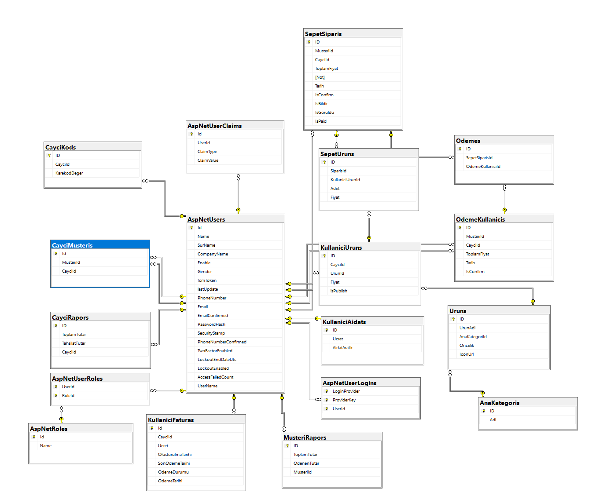

# Setup Project

## Requirements

- MSSQL Server
- .Net 4.6

## Web.config Setting

enter email value

- key="ToEmail"
- key="UserId"
- key="Password"

connectionString="server=serverAdress;database=cayyolla;uid=celal258;password=qwer1234;"

## Push Notification

- Firebase ServerKey

